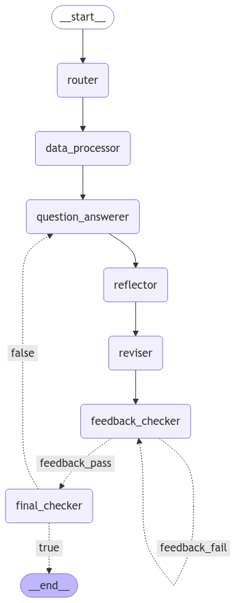

# ODU Academic Advisor AI

ODU Academic Advisor AI is a user-friendly, intelligent RAG chatbot designed to assist students in exploring academic programs at Old Dominion University (ODU). It provides detailed, personalized responses based on user queries about undergraduate and graduate programs, course requirements, and related information.

---

## Features

- **Program Information Retrieval**: Provides detailed information about ODU programs, including undergraduate and graduate offerings.
- **Feedback Integration**: Users can rate chatbot responses on a scale of 1 to 5 and optionally provide written feedback to better future responses.
- **Memory Context**: Retains conversation history to provide consistent, context-aware answers.
- **Caching Mechanism**: Reduces response time by caching program information for one week.
- **Interactive UI**: Simple and intuitive GUI for seamless interaction.

---

## Technologies Used

- **Programming Language**: Python
- **Machine Learning**:
  - [LangChain](https://langchain.com) for building AI workflows
  - [SentenceTransformers](https://www.sbert.net) for vector-based similarity search
  - AWS Bedrock for deploying the LLM (Claude-3.5 Sonnet v2 by Anthropic)
- **Web Scraping**: BeautifulSoup for extracting program data from the [ODU catalog](https://catalog.odu.edu/programs/).
- **GUI**: Tkinter for the chatbot interface.
- **Caching**: Diskcache for storing program data.

---

## Graph Visualization



---

## Prerequisites

1. **Python**: Ensure Python 3.8+ is installed.
2. **AWS Credentials**: Set up AWS access keys for Bedrock in a `.env` file.
3. **Install Dependencies**: Install required Python packages using `pip`.

```bash
pip install -r requirements.txt
```

### `.env` File Example

Create a `.env` file in the project directory with the following:

```
AWS_ACCESS_KEY_ID=your-access-key
AWS_SECRET_ACCESS_KEY=your-secret-key
AWS_SESSION_TOKEN=your-session-token
```

---

## How to Run

1. **Clone the Repository**

```bash
git clone https://github.com/your-username/odu-academic-advisor-ai.git
cd odu-academic-advisor-ai
```

2. **Run the Application**

```bash
python UI.py
```

3. **Interact with the Chatbot**
   - Enter your question in the text field and press Enter or click "Send".
   - Rate the chatbot's response on a scale of 1 to 5 using the slider.
   - Optionally provide feedback for improvement.

---

## Contributing

1. Fork the repository.
2. Create a new branch: `git checkout -b feature-name`.
3. Commit your changes: `git commit -m 'Add new feature'`.
4. Push to the branch: `git push origin feature-name`.
5. Submit a pull request.

---

## License

This project is licensed under the MIT License. See the `LICENSE` file for details.

---

## Contact

- **Name**: Guillaume Ratier
- **Email**: grati001@odu.edu
- **GitHub**: [your-username](https://github.com/GRatierODU)

---

We hope this project enhances your academic experience at ODU. Feel free to contribute and share feedback!

